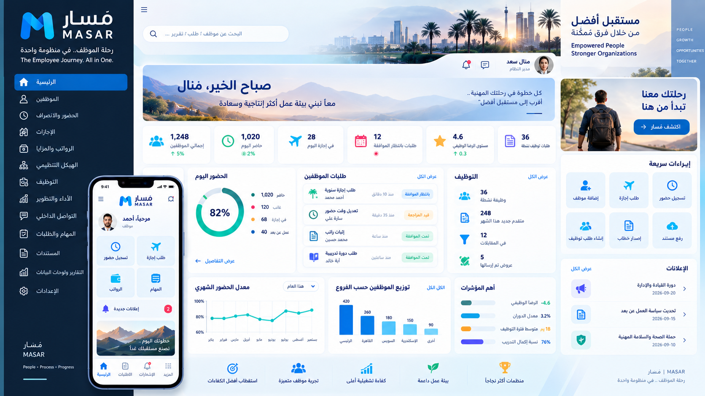

<p align="center">
  
</p>

# مَسار | MASAR

### Technology Snapshot

**React • TypeScript • Vite • NestJS • Prisma • PostgreSQL • REST API • JWT • RBAC**

**Focus:** HRMS • Workforce Management • ATS • Workflow Automation • HR Tech

## رحلة الموظف.. في منظومة واحدة
### The Complete Employee Journey in One Connected HR Platform

**MASAR** is an integrated Human Resources and Workforce Operations platform designed to connect the employee journey — from workforce planning and recruitment to attendance, requests, development, engagement and operational HR — within one governed digital ecosystem.

> This repository is a **public product showcase**. Production source code, credentials, employee data, internal configuration and confidential business information are intentionally excluded.

---

## Why MASAR?

HR operations are often fragmented across attendance devices, spreadsheets, recruitment tools, approval emails, employee files and separate performance systems.

MASAR brings these processes together around a single employee lifecycle and a connected data model:

**Plan → Recruit → Hire → Onboard → Work → Attend → Request → Develop → Engage → Support → Measure**

---

# Platform Capabilities

## 1. Organization & Employee Management
- Company and multi-branch organizational structure
- Central employee directory and searchable employee profiles
- Departments, job titles and organizational information
- Historical employee branch assignments
- Employee transfer between branches without losing history
- Employment, contact and workforce information
- Bulk employee import from Excel
- Architecture prepared for multi-company expansion

## 2. Smart Attendance & Workforce Presence
- GPS-based attendance
- Branch-specific geofencing
- Server-side location verification
- Location accuracy validation
- Suspicious/out-of-range attendance review workflow
- Configurable attendance method priority per branch
- Biometric/fingerprint attendance integration foundation
- Multiple attendance sources under one attendance model
- Optional attendance verification layers
- Work shifts and employee-shift assignment
- Flexible and rotating weekly rest-day patterns
- Official holidays calendar
- Manual attendance adjustments through controlled workflows
- Attendance review and approval
- Attendance history and auditability

### Attendance Policy Engine
MASAR includes a policy-oriented attendance model supporting:
- Configurable grace periods
- Late-arrival handling
- Early-departure handling
- Missing checkout cases
- Absence handling
- Official early-leave permissions
- Attendance-related penalties
- Overtime and attendance exceptions

---

## 3. Leave & Time-Off Management
- Configurable leave types
- Leave requests and approval
- Employee leave balances
- Accrued, carried-forward and used leave tracking
- Leave ledger with full transaction history
- Automatic balance updates after approved paid leave
- Holiday-aware leave foundation
- Comp-off / compensatory leave concepts
- Leave-balance reporting

---

## 4. Payroll-Period & Compensation Foundation
- Configurable payroll-cycle start day
- Non-calendar payroll periods
- Open / close payroll cycles
- Controlled changes after cycle closure
- Historical salary components
- Basic salary, allowances and fixed deductions structure
- Payroll-in-lieu requests
- Bonus requests
- Deduction requests
- Overtime records
- Benefits plans and employee enrollment
- Foundation for future full payroll calculation

> MASAR currently provides payroll-period governance and compensation structures; it does not present the showcase as a completed automatic net-pay calculation engine.

---

## 5. Unified Request & Approval Engine
Instead of building a separate approval mechanism for every HR process, MASAR uses a reusable workflow engine.

Supported workflow concepts include:
- Overtime requests
- Attendance-adjustment requests
- Shift-exchange requests
- Payroll-in-lieu requests
- Bonus requests
- Deduction requests
- Expense claims
- Leave approvals
- Recruitment requisitions and other extensible HR approvals

### Unified Task Box
Approvers can work from one inbox that aggregates actionable HR items such as:
- Pending attendance cases
- Pending leave requests
- Workflow requests
- Approval / rejection actions

This creates one consistent approval experience across the platform.

---

## 6. Notifications
- In-app notification center
- Unread notification counter
- Read / read-all actions
- Automatic notifications to eligible approvers
- Automatic decision notifications to request owners
- Architecture ready for future mobile push integration

---

## 7. Employee Documents & Policy Management

### Employee Documents
- Document metadata by employee
- Document type, issue date and expiry date
- Expiring-document monitoring
- HR visibility into upcoming expirations

### Company Policies
- Central company policy library
- Policy versioning
- Employee acknowledgement tracking
- Unacknowledged-policy visibility

---

## 8. Performance & Continuous Feedback
- Performance cycles
- Employee self-assessment
- Manager/reviewer assessment
- Review status lifecycle
- Performance objectives and competency-oriented foundation
- Promotion-readiness and potential signals in the broader talent model
- Continuous peer/manager feedback
- Recognition and improvement feedback types

---

## 9. Employee Engagement & Culture

### Vibe Surveys
- Short employee pulse surveys
- Numeric sentiment responses
- Optional comments
- Anonymous-response mode

### Company Events
- Internal event calendar
- Event date and location
- Employee RSVP: going / maybe / declined

These capabilities extend MASAR beyond HR administration into employee experience.

---

## 10. Internal Helpdesk
- Employee support tickets
- Categories such as HR, payroll, technical, facilities and policies
- Ticket assignment
- Ticket comments and collaboration
- Status lifecycle
- Notifications to support teams and employees

---

## 11. Employee Assignments
- Assign tasks to employees
- Priority and due dates
- Employee-controlled progress states
- Pending → In Progress → Completed lifecycle
- Assignment notifications

---

# 12. Recruitment & Talent Acquisition

MASAR is designed to connect recruitment directly to the employee lifecycle instead of treating ATS as an isolated system.

## Workforce Need → Hire
**Workforce Need → Job Requisition → Internal Talent Check → Job Definition → Candidate Sourcing → Screening → Assessment → Interview → Decision → Offer → Preboarding → Employee**

### Job Requisition
- Replacement, expansion and new-project requests
- Headcount and business justification
- Grade, department and employment type
- Salary budget range
- Target start date and priority
- Workflow-based approvals

### Smart Job Definition
- Job families
- Job-title profiles
- Skills catalog
- Competency requirements
- Required vs preferred capabilities
- Proficiency levels
- Job descriptions
- AI-assisted job-profile drafting with human review

### Internal Talent First
Before external sourcing, the architecture can evaluate existing employees using:
- Skills
- Competencies
- Performance
- Promotion readiness
- Development/training signals

This connects recruitment with internal mobility and succession opportunities.

### Candidate Sourcing & ATS
- Job vacancies
- Candidate profiles
- Candidate sources
- Recruitment pipeline
- Talent pool
- Pipeline stage history
- Career-portal / referral workflow foundation
- CV parsing architecture

### Explainable Intelligent Screening
Candidate matching is designed around explainable factors rather than an opaque decision:
- Skills match
- Experience match
- Education match
- Competency match
- Missing requirements
- Mandatory / knockout requirement flags
- Configurable weighting by job family

**Human decision remains final.**

### Assessments & Interviews
- Technical assessments
- Competency assessments
- Behavioral assessments
- Language assessments
- Structured interviews
- Competency-based scorecards
- Interview panels
- Interview feedback
- AI-assisted feedback summarization concept with human-controlled decisions

### Candidate 360°
A consolidated candidate view can bring together:
- CV information
- Skills
- Experience
- Education
- Match breakdown
- Assessment results
- Interview scorecards
- Interview feedback
- Side-by-side candidate comparison

### Offers & Hiring
- Job offers
- Salary and benefits proposal
- Offer approval workflow
- Offer negotiation history
- Accepted / rejected / expired lifecycle
- Candidate-to-employee conversion
- Reduced duplicate data entry

### Preboarding
- Onboarding cases
- Reusable onboarding checklist templates
- Role/job-specific onboarding foundation

### Recruitment Intelligence
The recruitment data model supports metrics such as:
- Time-to-fill
- Time-to-hire
- Vacancy aging
- Source quality
- Funnel conversion
- Offer acceptance
- Rejection reasons
- Recruiter workload
- Recruitment cost
- Quality-of-hire feedback loop

---

# 13. Reporting & Data Exchange

## Excel Import
- Bulk employee import
- Create or update employee records
- Row-level validation
- Error details without stopping the entire import
- Controlled branch-transfer rules

## Professional Reports
- Employee directory reports
- Attendance reports by period / branch
- Leave-balance reports
- PDF output
- Excel output
- Arabic/RTL-friendly reporting architecture
- Role-controlled report export

---

# 14. Security, Governance & Access Control

MASAR uses fine-grained Role-Based Access Control rather than relying only on screen visibility.

Core concepts:
- Super Admin
- HR Manager
- Branch Manager
- Employee
- Fine-grained permissions
- Branch-scoped access
- Multiple roles per user
- Server-side authorization
- Audit logs for sensitive actions
- Before/after change traceability
- Soft-delete patterns for sensitive HR records
- Controlled post-payroll-cycle changes
- Authentication and token-based access

---

# 15. Architecture

MASAR follows a modular enterprise architecture designed for progressive growth.

### Application
- **Frontend:** React + TypeScript + Vite
- **Backend:** NestJS + TypeScript
- **Data Layer:** Prisma
- **Database:** PostgreSQL-ready architecture
- **API:** REST
- **Security:** JWT + RBAC
- **Deployment:** Cloud / container-ready architecture

### Design Principles
- Modular Monolith first
- Clear domain modules
- API-first integration
- Auditable workflows
- Historical records instead of destructive overwrites
- Scalable multi-branch data model
- Future mobile integration
- Future ERP/payroll integration
- Future SaaS / multi-company expansion

---

# Employee Journey

```text
Workforce Planning
       ↓
Recruitment & Internal Mobility
       ↓
Offer & Preboarding
       ↓
Employee Profile
       ↓
Attendance ── Shifts ── Leave
       ↓
Requests & Approvals
       ↓
Compensation & Benefits
       ↓
Performance & Competencies
       ↓
Feedback & Engagement
       ↓
Helpdesk & Assignments
       ↓
Reports & Workforce Insights
```

---

# Product Vision

MASAR is not designed as a collection of disconnected HR screens.

The goal is a **connected employee journey**, where information created at one stage becomes useful at the next:

- Recruitment data can become employee data.
- Employee skills can support internal mobility.
- Attendance and leave can feed workforce operations.
- Performance can enrich talent decisions.
- Policies, requests and approvals remain governed and auditable.
- HR teams gain one operational view instead of fragmented processes.

## مَسار | MASAR
### رحلة الموظف.. في منظومة واحدة
**One Employee Journey. One Connected HR Ecosystem.**

---

## Showcase & Confidentiality Notice

This public repository demonstrates product scope and solution design only.

It intentionally excludes:
- Production source code
- Employee or candidate records
- Credentials and secrets
- Internal URLs and infrastructure details
- Customer/company-specific information
- Biometric or precise location data
- Private documents
- Proprietary configuration

Some capabilities described above represent implemented backend modules, while others are architectural foundations or documented expansion paths. The showcase avoids presenting planned capabilities as production-complete functionality.
